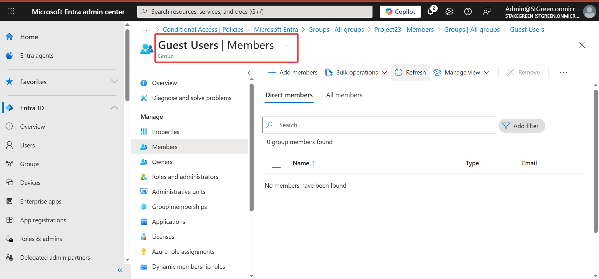
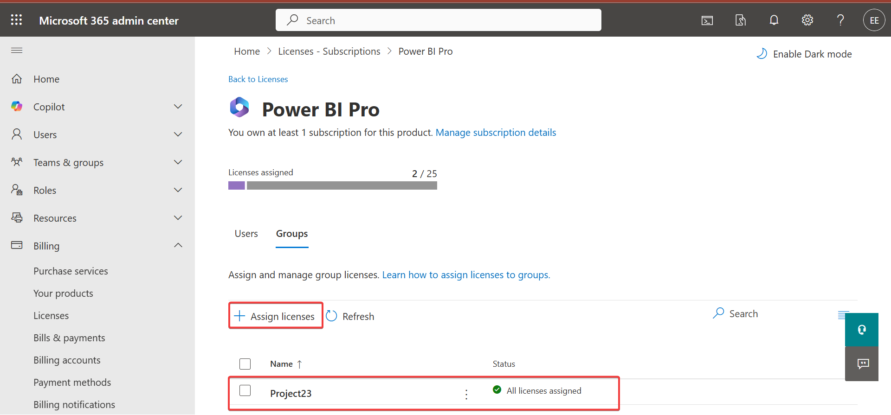
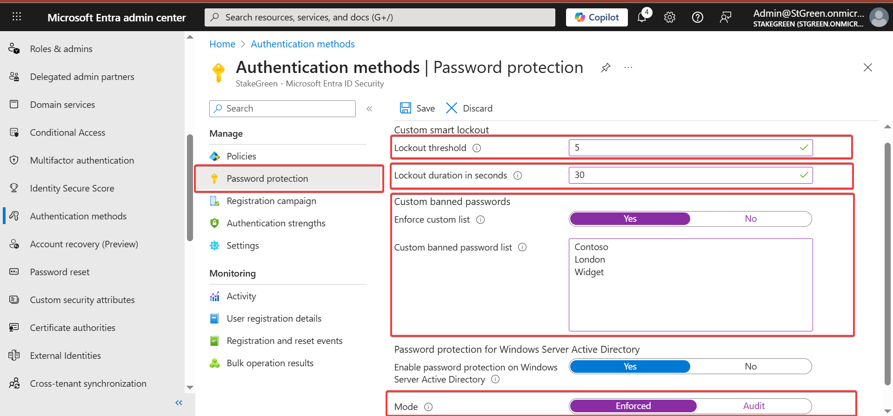
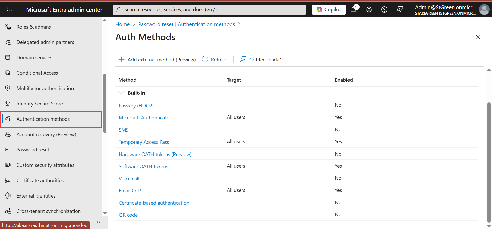
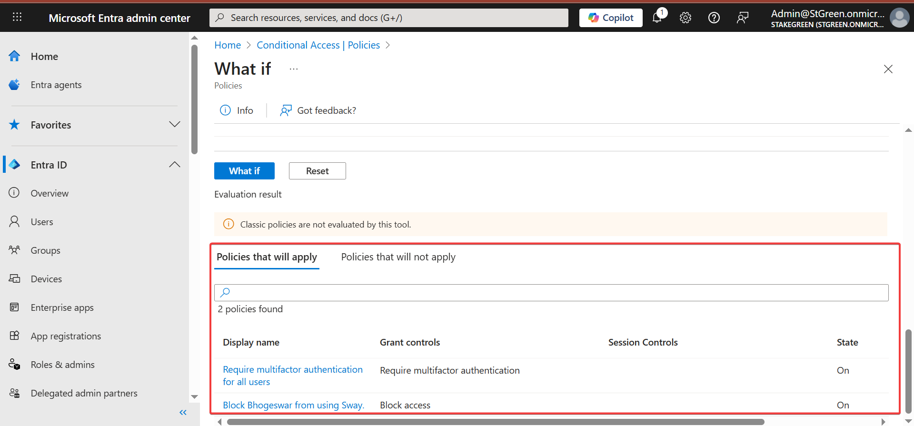

# ☁️ Project: Zero Trust Identity Governance & Access Control

**Platform:** Microsoft Entra ID (Azure)  
**Focus:** Identity Lifecycle Management, Authentication Hardening, and Adaptive Access Control

## 📝 Executive Summary
In a "Remote-First" organizational model, identity is the new security perimeter. This project documents the implementation of a Zero Trust identity framework using Microsoft Entra ID. I configured the end-to-end identity lifecycle, from secure user onboarding and Role-Based Access Control (RBAC) to adaptive authentication policies. By deploying Multifactor Authentication (MFA), Self-Service Password Reset (SSPR), and Conditional Access, I reduced the organization's attack surface and minimized administrative overhead.

---

## 🏗️ The Implementation Framework
The project was executed in three distinct phases to ensure a "Defense-in-Depth" posture for organizational identities.

### Phase 1: Identity Lifecycle & RBAC
The foundation of the project involved establishing a structured identity hierarchy. I configured both **Microsoft 365 Groups** (for collaboration) and **Security Groups** (for access control). 
* **Action:** Implemented licensing automation and assigned group owners to decentralize management.
* **Outcome:** Ensured that users receive exactly the permissions needed for their roles (Least Privilege).

---

### Phase 2: Authentication Hardening (SSPR & Password Protection)
To defend against credential-based attacks, I implemented advanced password protection and recovery features.
* **Password Protection:** Configured lockout thresholds and duration values to thwart brute-force and "password spray" attempts.
* **SSPR (Self-Service Password Reset):** Enabled SSPR for specific security groups, allowing users to securely reset passwords without helpdesk intervention.
* **Outcome:** Improved user productivity while significantly reducing the helpdesk's ticket volume.

---

### Phase 3: Adaptive Access (MFA & Conditional Access)
This phase focused on "never trust, always verify." I deployed Conditional Access policies to enforce context-aware security.
* **MFA Deployment:** Enabled per-user MFA settings to ensure a second factor of authentication for all sign-ins.
* **Conditional Access:** Reviewed and tested policies that grant or block access based on specific signals (User, Device, Location).
* **What-If Analysis:** Performed "What-If" simulations to predict how policies would affect users before deployment, ensuring zero disruption to legitimate work.

---

## 🛡️ Strategic Value
Implementing this identity suite provides the organization with three core pillars of cloud security:
1. **Reduced Breach Risk:** MFA and Conditional Access block 99.9% of automated identity attacks.
2. **Operational Scalability:** Groups and SSPR allow the IT team to scale without a linear increase in manual tasks.
3. **Forensic Readiness:** Centralized identity logs in Entra ID provide a clear audit trail for compliance (SOC2/HIPAA).

---

## 💡 Key Skills Demonstrated
* **Microsoft Entra ID Administration:** Full-cycle management of users, security groups, and cloud identities.
* **Identity Governance:** Expert configuration of RBAC and license assignment.
* **Adaptive Security:** Designing and testing Conditional Access policies using the "What-If" tool.
* **Cloud Compliance:** Enforcing password policies and SSPR to meet modern security standards.

---

## 📂 Project Assets
* 📄 [Detailed Identity Security Lab Report (Google Doc)](https://docs.google.com/document/d/1QUl6lLzlmMVe8NHpEghW0gz5qjom02sEu1ovdJlfDS4/edit?usp=sharing)
* 📁 [Identity Management Screenshots](./images/)
